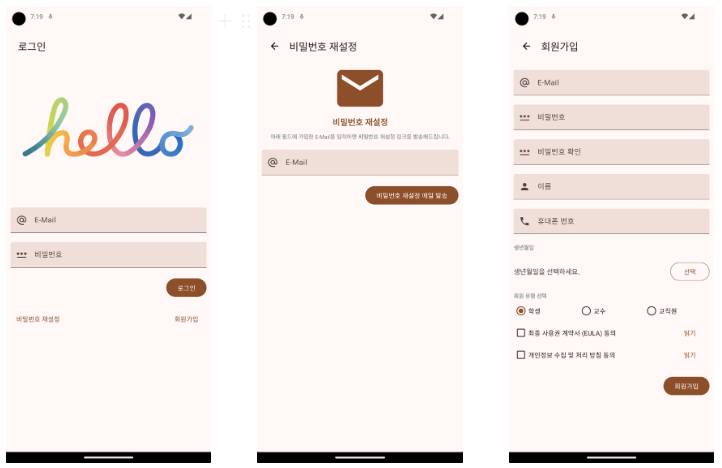
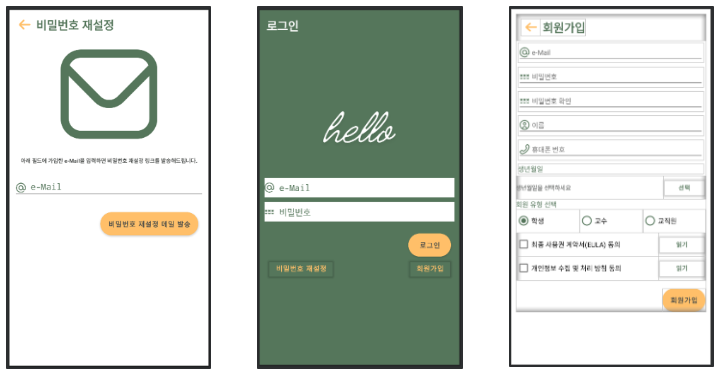

# LOGIN UI Project

This is my 4th Android Studio Weekly Project (other two are not commited yet).

This priject is a demo recreation for a login page. 

Here is the example I followed:

Here is my version of the UI:

Here is the project instruction.
### 사용자 관리 Flow

Activity 는 한 개의 Activity만 사용하고, Activity의 이름은 ‘StartActivity’로 작명하시오.

Activity 에 대한 ContentView는 ‘layout_start.xml’ 파일로 하고, 해당 XML 파일에는 Fragment View 표시를 위한 FrameLayout만 존재하도록 구현하시오.

로그인, 회원가입, 비밀번호 재설정 View는 Fragment로 구현하시오.

### → 조건 : 로그인

로그인 View는 앱의 Entry Point가 되어야 함.

E-Mail, Password Text Field 중 하나라도 입력되지 않은 상태로 ‘로그인’ 버튼을 탭한 경우 공백 필드 Alert Dialog를 표시하시오.

‘비밀번호 재설정’ 버튼을 탭하면 비밀번호 재설정 View로 이동하시오.

‘회원가입’ 버튼을 탭하면 회원가입 View로 이동하시오.

### → 조건 : 비밀번호 재설정

E-Mail이 입력되지 않은 상태로 ‘비밀번호 재설정 메일 발송’ 버튼을 탭한 경우 

공백 필드 Alert Dialog를 표시하시오.

TopAppBar에는 ‘뒤로 가기’ 버튼을 제공하고, 버튼을 탭하면 이전 View로 전환하시오.

### → 조건 : 회원가입

회원가입 View는 이전 과제에서 작성한 회원가입 View를 그대로 사용해도 상관없음.

회원가입 View는 이전 과제에서 제공한 조건과 동일한 조건으로 구현하시오.

TopAppBar에는 ‘뒤로 가기’ 버튼을 제공하고, 버튼을 탭하면 이전 View로 전환하시오.

#### PS.
- The Register Fragment code is reused from my last project "4thWeek-membership"

https://github.com/laughingdog911/4thWeek-membership

- I added extra settings for:

1. Login Fragment: if all fields are filled, circular progress view is shown.

2. ResetPW Fragment: if email is filled, alert dialog "email sent" is shown.

- This is a great exercise project for practicing fragment bindings. 

